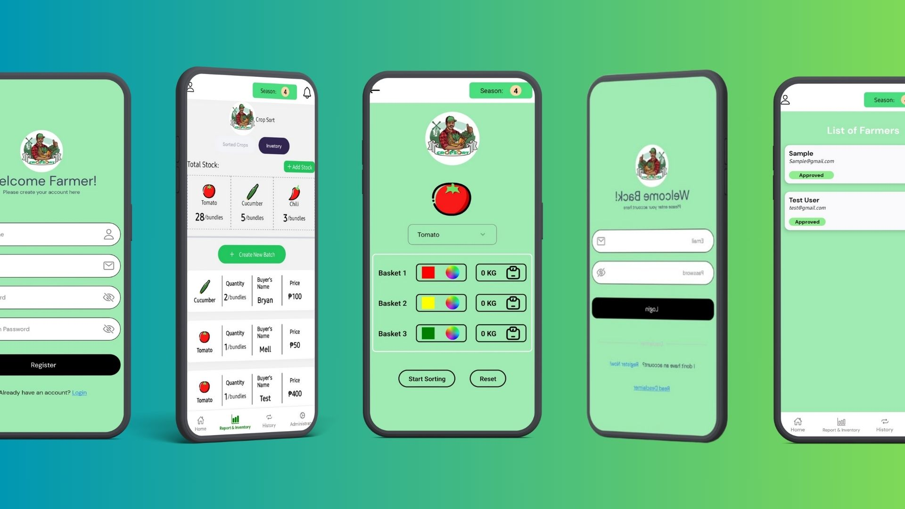
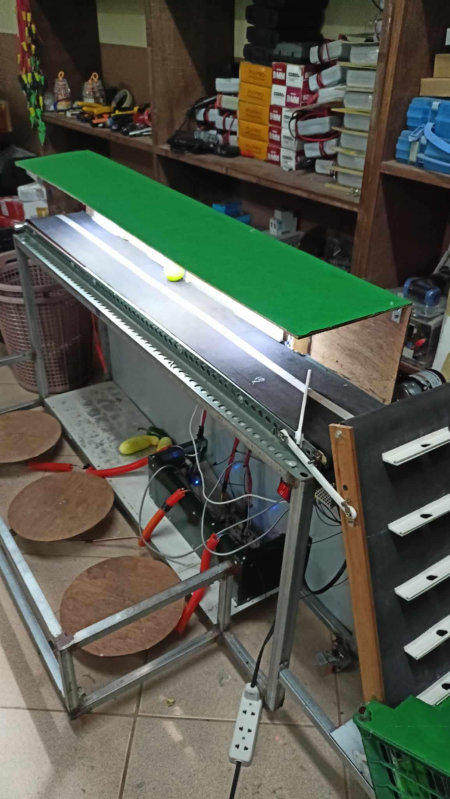
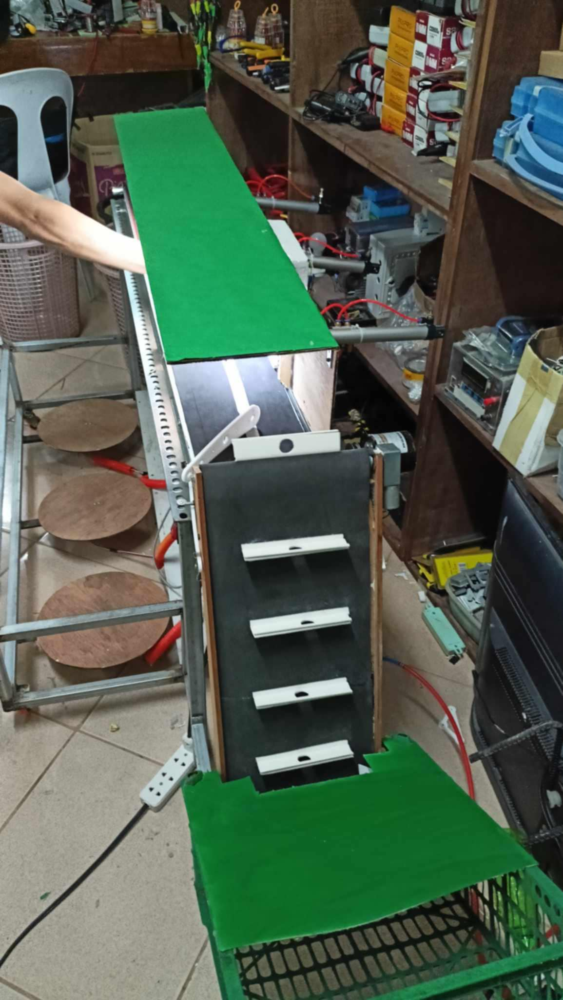

# CropSort - Crop Sorting and Inventory Management System

**CropSort** is an innovative **crop sorting system** designed to sort and manage crops like **Tomato**, **Chili**, and **Cucumber** using a mobile application. Developed with **React Native**, **Expo**, **ESP8266**, **TCS3200 Color Sensor**, **Load Cell** technology, and **Firebase**, the system sorts crops into baskets based on color and monitors the weight of each basket in real time. Once a basket reaches 10kg, the system automatically updates the inventory. Additionally, the app supports crop orders, tracking the store's name and the quantity in kilograms for each order.

## Features

- **Crop Sorting**: Sort crops into different baskets based on color. For tomatoes, sort them into 3 baskets depending on their color (green, yellow, or red).
- **Color Detection**: Uses the **TCS3200 Color Sensor** to identify crop color and assign them to specific baskets.
- **Weight Monitoring**: Monitors the weight of each basket using a **Load Cell** sensor. When a basket reaches 10kg, it is automatically added to the inventory.
- **Real-Time Inventory Updates**: Syncs data with Firebase for real-time updates on inventory and basket weight.
- **Order Tracking**: Manages orders of crops from stores, including the store's name and the amount of each crop ordered (in kilograms).
- **Inventory Management**: Automatically updates inventory as crops are sorted, and the weight is added once a basket reaches 10kg.
- **User-Friendly Interface**: Simple and intuitive interface for managing crop sorting, basket weight, inventory, and orders.

## Installation

### Prerequisites

Make sure the following tools are installed:

- **Node.js** (latest version)
- **Expo CLI**
- **React Native**
- **Firebase Account** (for real-time data storage and authentication)
- **ESP8266** (for Wi-Fi connectivity)
- **TCS3200 Color Sensor** (for crop color detection)
- **Load Cell** (for weight monitoring)
- **HX711 Amplifier** (for interfacing Load Cell)
- **Arduino IDE** (for programming the ESP8266)

### Steps

1. Clone the repository:

    ```bash
    git clone https://github.com/DevMike13/CropSort.git
    cd CropSort
    ```

2. Install dependencies:

    ```bash
    npm install
    ```

3. Install Expo CLI (if not already installed):

    ```bash
    npm install -g expo-cli
    ```

4. Set up Firebase:
   - Create a Firebase project and configure it in your app.
   - Get the Firebase config and add it to the `firebaseConfig.js` file in your project.

5. Program the **ESP8266**:
   - Use **Arduino IDE** to program the **ESP8266** to read data from the **TCS3200 Color Sensor** and **Load Cell**.
   - Install necessary libraries such as `ESP8266WiFi`, `FirebaseESP8266`, `HX711` for interfacing with the Load Cell, and `TCS3200` for the color sensor.
   - After programming, upload the code to your ESP8266 to establish communication with the app and Firebase.

6. Run the application:

    ```bash
    npx expo start
    ```

7. Open the app in the **Expo Go** app on your phone, or use an **Android/iOS** emulator to run the app.

## Usage

1. **Select Crop**: Choose the crop you want to sort (Tomato, Chili, or Cucumber).
2. **Sort Crops by Color**: The **TCS3200 Color Sensor** will automatically detect the color of each crop and assign it to a corresponding basket. For tomatoes, there are 3 baskets based on the color detected (e.g., green, yellow, and red).
3. **Monitor Basket Weight**: The **Load Cell** sensor monitors the weight of each basket in real time.
4. **Inventory Update**: Once the weight of any basket reaches 10kg, the system will automatically update the inventory in Firebase and reset the basket weight to zero.
5. **Create Orders**: The app allows users to create crop orders with the store's name and the quantity of the crop in kilograms.
6. **View Orders**: Orders are tracked in real time, showing the crop name, store, and order weight.
7. **Review Inventory**: View the complete inventory data in Firebase, which is updated each time a basket reaches 10kg.

## Firebase Integration

The app uses Firebase for:

- **Authentication**: Secure user login and access.
- **Real-Time Database**: Storing and retrieving real-time data such as crop inventory, basket weight, sorting information, and crop orders.
- **Inventory Updates**: Automatically updates the inventory when the weight of a basket hits 10kg.
- **Order Tracking**: Allows users to create and view crop orders from stores, with the store name and the quantity of the crops in kilograms.

## Real-Time Data

The app allows for real-time monitoring of the following:

- **Basket Weight**: Displays the current weight of each basket as crops are sorted into them.
- **Inventory**: View the total weight of crops added to the inventory after each basket reaches 10kg.
- **Crop Orders**: View real-time orders placed by stores with the crop name, store name, and order quantity in kilograms.

## Technologies Used

- **React Native**: For building the cross-platform mobile app.
- **Expo**: For rapid development and testing.
- **Firebase**: For real-time database, authentication, and inventory/order management.
- **ESP8266**: For Wi-Fi communication between the app and sensors.
- **TCS3200**: For color sensing and crop sorting.
- **Load Cell**: For weight monitoring in each basket.
- **HX711 Amplifier**: For interfacing with the Load Cell.

## Screenshots

Here’s how the **CropSort** app looks on mobile devices:



## Prototype

Here’s some images of the **CropSort** sorting machine prototype:

  

